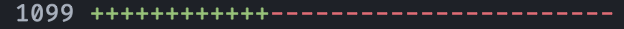

# ReduxModule

> The ultimate [Redux][redux] boilerplate reducer

```js
// this creates an action type, action creator, AND reducer handle
app.create('setUser', ['user'])
```

## Table of Contents

- [Installation](#installation)
- [Why](#why)
- [Comparison with Vanilla Redux](#comparison-with-vanilla-redux)
- [Usage](#usage)
- [API](#api)
  - [ReduxModule](#reduxmodule)
  - [create](#create)
  - [module](#module)
- [Suggested Patterns](#suggested-patterns)
  - [Export Types and Creators](#export-types-and-creators)
  - [Modules](#modules)
  - [Side Effects](#side-effects)
  - [Use Reducer Example](#use-reducer-example)

## Installation

````sh
npm install --save @labelinsight/redux-module
```(

```js
// module
import ReduxModule from '@labelinsight/redux-module'

// commonjs
const ReduxModule = require('@labelinsight/redux-module')

// browser
window.ReduxModule
````

## Why?

redux-module reduces boilerplate noise by removing the need for developers to
have to create types or wire them to creators or reducer handlers, _ever_. The
module also provides a convenient setter syntax for automatically creating state
merges when updates do not require previous state or logic, which cuts out a
surprising amount of code. It has zero dependencies and requires no middleware.
It is just a boilerplate ... reducer 😜.

## Comparison with Vanilla Redux

```js
const initialState = {
  showLoginForm: false,
  loginPending: false,
  user: null,
}

const SHOW_LOGIN_FORM = 'SHOW_LOGIN_FORM'
const SET_LOGIN_PENDING = 'LOGIN_PENDING'
const SET_USER = 'SET_USER'

export const showLoginForm = (showLoginForm) => ({
  type: SHOW_LOGIN_FORM,
  showLoginForm,
})

export const setLoginPending = (loginPending) => ({
  type: SHOW_LOGIN_FORM,
  loginPending,
})

export const setUser = (user) => ({
  type: SET_USER,
  user,
})

// example assuming redux thunk
export const login = (email) => async (dispatch) => {
  // fetch user, etc.
}

// even before redux-module we preferred a handlers map to a switch case
const handlers = {}

handlers[SHOW_LOGIN_FORM] = (state, { showLoginForm }) => ({
  ...state,
  showLoginForm,
})

handlers[SET_LOGIN_PENDING] = (state, { loginPending }) => ({
  ...state,
  loginPending,
})

handlers[SET_USER] = (state, { user }) => ({
  ...state,
  user,
})

export const reducer = (state = initialState, action) =>
  handlers[action.type] ? handlers[action.type](state, action) : state
```

With ReduxModule:

```js
import ReduxModule from '@labelinsight/redux-module'

const app = new ReduxModule('app')

const initialState = {
  showLoginForm: false,
  loginPending: false,
  user: null,
}

app.create('showLoginForm', ['showLoginForm'])
app.create('setLoginPending', ['loginPending'])
app.create('setUser', ['user'])

export const getUser = (email) => async (dispatch) => {
  // ...
}

export const reducer = app.reducer(initialState)
export default app
```

Hopefully you are sold by this minimal example, but if not, consider this: a
typical redux "round trip" involves three JavaScript expressions: an action
type, a creator, and a reducer case. ReduxModule reduces that to one. So, if
your slice of redux has say, 30 of these routines, that means you'll need to
write 90 expresions. With redux-module you'd write 30. Furthermore in vanilla
redux, assuming basic example above that just sets a top-level key and uses
prettier formatting, each "round trip" equates to 9 lines of code. 90 \* 9 = 810
lines of code! With redux-module, again, it's just 30 :).

The image below is a real before & after diff of refactoring one of our projects
to use redux-module:



## Usage

First, create an instance:

```js
const app = new ReduxModule('app')
```

The instance returned will have the following structure:

```js
{
  // you _may_ need this if working with something like redux-saga,
  // otherwise it is just an internal storage mechanism for the module instance
  types: {},

  creators: {},

  // you will 99% never need to work with this
  handlers: [],

  // you will use this to create new type/action/reducer combos
  create: Function,

  // you will only use this to create a submodule of a existing instance
  module: Function
}
```

The heart of redux-module is the `#create` method. To create an action that sets
a simple value on a top-level key of state, you can use _setter shorthand_
syntax:

```js
app.create('setColor', ['color'])
```

Those brackets instruct the instance to set the `color` property on state when
the `setColor` action is dispatched. It is the same as manually doing this:

```js
// NOTE: the code here is just to illustrate how types, creators, and handlers are
// stored internally! You should not use the module this way!
app.types.setColor = 'app/setColor'

app.creators.setColor = (color) => ({
  type: 'app/setColor',
  color,
})

app.handlers['app/setColor'] = (state, { color }) => ({
  ...state,
  color,
})
```

To dispatch the `setColor` action:

```js
dispatch(app.creators.setColor('rebeccapurple'))
```

"Setter shorthand" allows for multiple values

```js
store.getState() // => { user: {} }

app.create('setFooAndBar', ['foo', 'bar'])

dispatch(app.creators.setFooAndBar(10, 11))
store.getState() // => { user: {}, foo: 10, bar: 11 }
```

For traditional reducer logic, you can provide a reducer case as the last
argument. It has the same signature as a redux reducer.

```js
app.create('loginFailed', 'status', (state, { status }) => ({
  ...state,
  // some merge logic
}))
```

> Note how the above status argument definition is not wrapped in braces. You
> cannot mix this signature with setter shortand syntax.

The final step is to create a reducer. Since we already defined our reducer
handles directly via calls to [create](#create), the only thing left to do is
call `app.reducer` and send the result to Redux' createStore:

```js
// app.js
// ...
const initialState = { user: null, alert: { ... } }

export const reducer = app.reducer(initialState)

// store.js
// ...
import { reducer as app } from './app'

const store = createStore({ app }, ...)
```

## API

### ReduxModule

The default export.

```js
new ReduxModule(name: string): => Object
```

#### Properties:

- `types`: synchronous action creator type defs
- `creators`: all action creators created with `create`
- `handlers`: all reducer handlers created in `create`.
- `name`: the ReduxModule instance name as passed to the constructor.

### `create`

Register a type, action creator, and optional reducer handle. Take care to
memorize the different signatures this method takes.

##### Signatures:

#### `(type: string): ActionCreator`

Creates an action creator with no payload.

#### `(type: string, ...actionArgs: Array<string>): ActionCreator`

Redux action creator

```js
const app = new ReduxModule('app')
app.create('foo', 'a', 'b')
app.creators.foo(1, 2) // => { type: 'app/foo', a: 1, b: 2 }
```

#### `(type: string, setter: Array<string>): ActionCreator`

Redux action creator and a reducer using "setter shorthand".

```js
const app = new ReduxModule('app')

app.create('foo', 'a', 'b')
app.create('bar', ['a', 'b'])

const reducer = app.reducer()

const state = { a: 98, b: 99 }

reducer(state, app.creators.foo(1, 2)) // => { a: 98, b: 99 }
reducer(state, app.creators.bar(1, 2)) // => { a: 1, b: 2 }
```

#### `(type: string, ...args?: Array<string>, reducerHandle: Function)`

If the last argument to [`create`](#create) is a function, it will be registered
as a reducer "case" for the action type specified by the `type` argument.

```js
const app = new ReduxModule('app')

app.create('setEmail', 'email', (state, { email }) => ({
  ...state,
  user: {
    ...state.user,
    email,
  },
}))

const state = {
  user: {
    email: undefined,
  },
}

const reducer = app.reducer()

reducer(state, setEmail('example@domain.com'))
// => { user: { email: 'example@domain.com' } }
```

### `#module(name: string, ?options: Object)`

Create a sub-module of a ReduxModule instance. A submodule will inherit the
parent module options and prefix the parent module name with its own name:

```js
const app = new ReduxModule('app')
const sub = app.module('sub')

const feature = sub.module('feature')
feature.create('hello')
feature.types.hello === 'app/sub/feature/hello'
```

### `#reducer(initialState?: Object)`

Create a reducer which will utilize all handlers defined from previous
[`create`](#create) calls.

## Suggested Usage Patterns

### Export Types and Creators

One of the benefits, or caveats, depending on your coding style, is that types
and creators are attached to a module instance. I personally find this super
convenient and there are some patterns that help.

```js
// app.js
const reducer = app.reducer()
const { types, creators } = app

export { types, creators, reducer }
export default app
```

Then, when mapping:

```js
import { creators } from './app'

// if you need them all
const mapDispatchToProps = creators

// or just provide the ones this container needs:
const mapDispatchToProps = {
  foo: creators.foo,
  bar: creators.bar,
}
```

At scale this practice of exporting/importing the `#creators` object leaves a
lot less clutter around in your app as you won't be in the business of managing
individual creator functions. The greater benefit comes when refactoring. In
vanilla redux, imagine we have an action type called `OPEN_GROUP`, and we want
to rename it to `OPEN_PROJECT`. You'd have to rename the following:

- left hand side of type declaration
- right hand side of type declaration
- export name of action creator
- type inclusion on action creator
- reducer handle key (or case condition)
- import name in all Container files
- mapping reference in all Container files

That's a _minimum_ of 7 renames that can't be done with a simple regexp since
your types and creators will have completely different casing.

With redux-module, using the `export { creators } / import { creators }`
pattern, this becomes:

- type name
- mapping reference in all Container files

And the beauty of this is you _can_ do it with a single find/replace since your
types and creators will have the same name, er, that is if you stick with the
default style used in the examples.

If you would still prefer to use individual exports, you can export the return
value from `#create`

```js
export const setUser = app.create('setUser')
```

...though that is the exact redundancy redux-module aims to avoid

### Modules

The usage of `app` as the module name in all previous examples is not contrived.
In general, you should only need to call the ReduxModule constructor once to
create a top level module, and create submodules from that instance. You'll want
to keep this top-level parent module _small_, as you'll be importing it into
various routes and feature folders to create submodules, and will want your
route build chunks to be small. Only use the parent `app` module for really
important things that might be used across the entire app.

Here is an example directory structure following Label Insight's conventions
(files not related to omitted for brevity)

```
/src
  /store
    redux (app = new ReduxModule('app'))
  /routes
    /Products
      redux (products = app.module('products'))
    /Product
      redux (product = app.module('product'))
```

And looking into redux-logger streams in dev tools, we'll see action dispatches
from this app as well as our internal libraries like this:

```js
‣ action auth/success
‣ action featureFlags/setFlags
‣ action app/locationChange
‣ action app/products/getProducts
‣ action app/products/setProducts
‣ action app/locationChange
‣ action app/product/setProduct
‣ action app/product/update
```

### Side Effects

Side effects are not the responsibility of this library (similar to redux
itself). There is nothing getting in the way of common side effect solutions
offered by [redux-thunk] or [redux-saga]. In any case, here are a couple code
examples illustrating how these two solutions work along with ReduxModule:

**redux-saga**

```js
// app.js
import ReduxModule from '@labelinsight/redux-module'

const app = new ReduxModule('app')

app.create('getFoo', 'bar')
app.create('setFoo', ['foo'])

export const reducer = app.reducer()
export default app


// sagas.js
import app from './app'

export default function saga() {
  yield takeEvery(app.types.getFoo, onGetFoo)
}

function* onGetFoo({ bar }) {
  const response = yield call(api.getFoo, bar)
  yield put(app.creators.setFoo(response.foo))
}
```

**redux-thunk**

There is absolutely nothing special to do with thunks, since thunks don't make
use of action types. One thing you _can_ do to for the sake of code organization
is add your thunks to the `ReduxModule#creators` object so you don't have to
worry about managing imports/exports:

```js
// app.js
app.create('setModalOpen', ['modalOpen'])

// our thunk def:
app.creators.getFoo = () => (dispatch) => {
  // implmentation...
}

// SomeContainer.js
import app from './app'

const mapStateToProps = {
  setModalOpen: app.creators.setModalOpen,
  getFoo: app.creators.getFoo,
}
```

### Use Reducer Example

There is nothing preventing you from using redux-module along with React's built
in [`useReducer`][use-reducer] hook.

```js
import React, { useReducer } from 'react'
import ReduxModule from '@labelinsight/redux-module'

const app = new ReduxModule('app')

app.create('setFoo', ['foo'])

const reducer = app.reducer()
const initialState = { foo: undefined }

export default function MyComponent() {
  const [state, dispatch] = useReducer(reducer, initialState)

  // ...
}
```

## License

MIT

[redux]: https://github.com/reduxjs/redux
[redux-saga]: https://github.com/redux-saga/redux-saga
[redux-thunk]: https://github.com/reduxjs/redux-thunk
[use-reducer]: https://reactjs.org/docs/hooks-reference.html#usereducer
